# Pandas-Bokeh

**Pandas-Bokeh** provides a [Bokeh](https://bokeh.pydata.org/en/latest/) plotting backend for [Pandas](https://pandas.pydata.org/), [GeoPandas](http://geopandas.org/) and [Pyspark](https://spark.apache.org/docs/latest/api/python/index.html) **DataFrames**, similar to the already existing [Visualization feature of Pandas](https://pandas.pydata.org/pandas-docs/stable/visualization.html). Importing the library adds a complementary plotting method ***plot_bokeh()*** on **DataFrames** and **Series**.

With **Pandas-Bokeh**, creating stunning, interactive, HTML-based visualization is as easy as calling:
```python
df.plot_bokeh()
```
---


**Pandas-Bokeh** also provides native support as a Pandas Plotting backend for [Pandas >= 0.25](https://pandas.pydata.org/pandas-docs/stable/whatsnew/v0.25.0.html). When **Pandas-Bokeh** is installed, switchting the default Pandas plotting backend to Bokeh can be done via:

    pd.set_option('plotting.backend', 'pandas_bokeh')

More details about the new Pandas backend can be found [below.](#pandas_backend)

---

For more information have a look at the [Examples](#Examples) below or at  notebooks on the [Github Repository](https://github.com/PatrikHlobil/Pandas-Bokeh/tree/master/Documentation) of this project. 


<br>

## Installation

You can install **Pandas-Bokeh** from [PyPI](https://pypi.org/project/pandas-bokeh/) via *pip*

    pip install pandas-bokeh

or *conda*:

    conda install -c patrikhlobil pandas-bokeh 

With the current release 0.4, **Pandas-Bokeh** officially supports **Python 3.5** and newer. It will probably still work for older Python versions, but is not tested against these.

<br>

The current release is **0.4**. For more details, see [Release Notes](#releasenotes).

<br>

## How To Use

### Classical Use
<p id="Basics"> </p>

The **Pandas-Bokeh** library should be imported after **Pandas**, **GeoPandas** and/or **Pyspark**. After the import, one should define the plotting output, which can be:

* **pandas_bokeh.output_notebook()**: Embeds the Plots in the cell outputs of the notebook. Ideal when working in Jupyter Notebooks.

* **pandas_bokeh.output_file(filename)**: Exports the plot to the provided filename as an HTML.

For more details about the plotting outputs, see the reference [here](#Layouts) or the [Bokeh documentation](https://bokeh.pydata.org/en/latest/docs/user_guide/quickstart.html#getting-started).

#### Notebook output (see also [bokeh.io.output_notebook](https://bokeh.pydata.org/en/latest/docs/reference/io.html#bokeh.io.output_notebook))

```python
import pandas as pd
import pandas_bokeh
pandas_bokeh.output_notebook()
```

#### File output to "Interactive Plot.html" (see also [bokeh.io.output_file](https://bokeh.pydata.org/en/latest/docs/reference/io.html#bokeh.io.output_file))

```python
import pandas as pd
import pandas_bokeh
pandas_bokeh.output_file("Interactive Plot.html")
```

### **Pandas-Bokeh** as native Pandas plotting backend
<p id="pandas_backend"> </p>

For pandas >= 0.25, a plotting backend switch is natively supported. It can be achievied by calling:

    import pandas as pd
    pd.set_option('plotting.backend', 'pandas_bokeh')

Now, the plotting API is accessible for a Pandas DataFrame via:

    df.plot(...)

All additional functionalities of **Pandas-Bokeh** are then accessible at *pd.plotting*. So, setting the output to notebook is:

    pd.plotting.output_notebook()

or calling the [grid layout functionality](#dashboard_layouts):

    pd.plotting.plot_grid(...)

**Note:** Backwards compatibility is kept since there will still be the *df.plot_bokeh(...)* methods for a DataFrame.

<p id="output_file"> </p>


<br>

---

### Plot types

Supported plottypes are at the moment:
* Pandas &  Pyspark DataFrames
  * [lineplot](#lineplot)
  * [pointplot](#pointplot)
  * [stepplot](#stepplot)
  * [scatterplot](#scatterplot)
  * [barplot](#barplot)
  * [histogram](#histogram)
  *  [areaplot](#areaplot)
  * [pieplot](#pieplot)
  * [mapplot](#mapplot)


* [Geoplots (Point, Line, Polygon) with **GeoPandas**](#geoplots)

Also, check out the complementary chapter [Outputs, Formatting & Layouts](#Layouts) about:

* [Output options (how to get HTML representation of Bokeh plots)](#output_options)
* [Number formats in Pandas-Bokeh (modify Hovertool number format, suppress scientific notation on axes)](#number_formats)
* [Dashboard layouts (How to layout multiple plots in rows, columns and grids)](#dashboard_layouts)

---

<br>
<br>


<p id="Examples"></p>


## Lineplot

### Basic Lineplot

This simple **lineplot** in **Pandas-Bokeh** already contains various interactive elements:

* a pannable and zoomable (zoom in plotarea and zoom on axis) plot
* by clicking on the legend elements, one can hide and show the individual lines
* a Hovertool for the plotted lines

Consider the following simple example:

```python
import numpy as np

np.random.seed(42)
df = pd.DataFrame({"Google": np.random.randn(1000)+0.2, 
                   "Apple": np.random.randn(1000)+0.17}, 
                   index=pd.date_range('1/1/2000', periods=1000))
df = df.cumsum()
df = df + 50
df.plot_bokeh(kind="line")       #equivalent to df.plot_bokeh.line()
```


Note, that similar to the regular **pandas.DataFrame.plot** method, there are also additional accessors to directly access the different plotting types like:

* ```df.plot_bokeh(kind="line", ...)``` → ```df.plot_bokeh.line(...)```
* ```df.plot_bokeh(kind="bar", ...)``` → ```df.plot_bokeh.bar(...)```
* ```df.plot_bokeh(kind="hist", ...)``` → ```df.plot_bokeh.hist(...)```
* ...


#### Advanced Lineplot

There are various optional parameters to tune the plots, for example:

* **kind**: Which kind of plot should be produced. Currently supported are: *"line", "point", "scatter", "bar"* and *"histogram"*. In the near future many more will be implemented as horizontal barplot, boxplots, pie-charts, etc.
* **x**: Name of the column to use for the horizontal x-axis. If the **x** parameter is not specified, the index is used for the x-values of the plot. Alternative, also an array of values can be passed that has the same number of elements as the DataFrame.
* **y**: Name of column *or* list of names of columns to use for the vertical y-axis. 
* **figsize**: Choose width & height of the plot
* **title**: Sets title of the plot
* **xlim**/**ylim**: Set visibler range of plot for x- and y-axis (also works for *datetime x-axis*)
* **xlabel**/**ylabel**: Set x- and y-labels
* **logx**/**logy**: Set log-scale on x-/y-axis
* **xticks**/**yticks**: Explicitly set the ticks on the axes
* **color**: Defines a single color for a plot.
* **colormap**: Can be used to specify multiple colors to plot. Can be either a list of colors or the name of a [Bokeh color palette](https://bokeh.pydata.org/en/latest/docs/reference/palettes.html)
* **hovertool**: If True a Hovertool is active, else if False no Hovertool is drawn.
* **hovertool_string**: If specified, this string will be used for the hovertool (@{column} will be replaced by the value of the column for the element the mouse hovers over, see also [Bokeh documentation](https://bokeh.pydata.org/en/latest/docs/user_guide/tools.html#custom-tooltip) and [here](#Dropdown))
* **toolbar_location**: Specify the position of the toolbar location (None, "above", "below", "left" or "right"). Default: *"right"*
* **zooming**: Enables/Disables zooming. Default: *True*
* **panning**: Enables/Disables panning. Default: *True*
* **rangetool** Enables a range tool scroller. Default *False*


* **kwargs****: Optional keyword arguments of [bokeh.plotting.figure.line](https://bokeh.pydata.org/en/latest/docs/reference/plotting.html#bokeh.plotting.figure.Figure.line)

<p id="hovertool_string_example"></p>

Try them out to get a feeling for the effects. Let us consider now:

```python
df.plot_bokeh.line(
    figsize=(800, 450),
    y="Apple",
    title="Apple vs Google",
    xlabel="Date",
    ylabel="Stock price [$]",
    yticks=[0, 100, 200, 300, 400],
    ylim=(0, 400),
    toolbar_location=None,
    colormap=["red", "blue"],
    hovertool_string="""</img> Apple 
                        
                        <h4> Stock Price: </h4> @{Apple}""",
    panning=False,
    zooming=False)
```

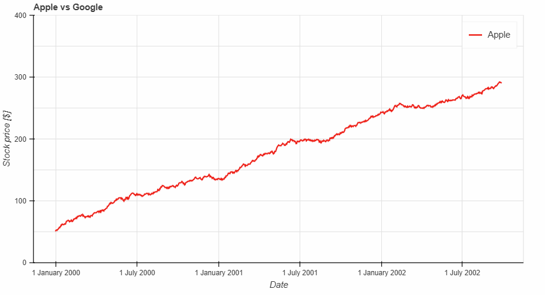

#### Lineplot with data points

For **lineplots**, as for many other plot-kinds, there are some special keyword arguments that only work for this plotting type. For lineplots, these are:

* **plot_data_points**: Plot also the data points on the lines
* **plot_data_points_size**: Determines the size of the data points
* **marker**: Defines the point type *(Default: "circle")*. Possible values are: 'circle', 'square', 'triangle', 'asterisk', 'circle_x', 'square_x', 'inverted_triangle', 'x', 'circle_cross', 'square_cross', 'diamond', 'cross'


* **kwargs****: Optional keyword arguments of [bokeh.plotting.figure.line](https://bokeh.pydata.org/en/latest/docs/reference/plotting.html#bokeh.plotting.figure.Figure.line)

Let us use this information to have another version of the same plot:

```python
df.plot_bokeh.line(
    figsize=(800, 450),
    title="Apple vs Google",
    xlabel="Date",
    ylabel="Stock price [$]",
    yticks=[0, 100, 200, 300, 400],
    ylim=(100, 200),
    xlim=("2001-01-01", "2001-02-01"),
    colormap=["red", "blue"],
    plot_data_points=True,
    plot_data_points_size=10,
    marker="asterisk")
```


#### Lineplot with rangetool

```python
ts = pd.Series(np.random.randn(1000), index=pd.date_range('1/1/2000', periods=1000))
df = pd.DataFrame(np.random.randn(1000, 4), index=ts.index, columns=list('ABCD'))
df = df.cumsum()

df.plot_bokeh(rangetool=True)
```

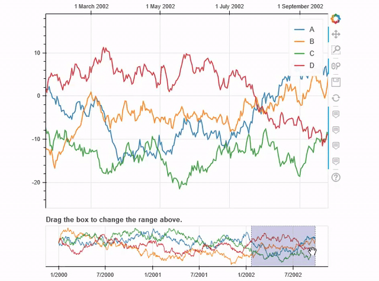

<br>

## Pointplot

If you just wish to draw the date points for curves, the **pointplot** option is the right choice. It also accepts the **kwargs** of [bokeh.plotting.figure.scatter](https://bokeh.pydata.org/en/latest/docs/reference/plotting.html#bokeh.plotting.figure.Figure.scatter) like *marker* or *size*:

```python
import numpy as np

x = np.arange(-3, 3, 0.1)
y2 = x**2
y3 = x**3
df = pd.DataFrame({"x": x, "Parabula": y2, "Cube": y3})
df.plot_bokeh.point(
    x="x",
    xticks=range(-3, 4),
    size=5,
    colormap=["#009933", "#ff3399"],
    title="Pointplot (Parabula vs. Cube)",
    marker="x")
```


<br>

## Stepplot
With a similar API as the line- & pointplots, one can generate a stepplot. Additional keyword arguments for this plot type are passes to [bokeh.plotting.figure.step](bokeh.plotting.figure.scatter), e.g. **mode** (before, after, center), see the following example 

```python

import numpy as np

x = np.arange(-3, 3, 1)
y2 = x**2
y3 = x**3
df = pd.DataFrame({"x": x, "Parabula": y2, "Cube": y3})
df.plot_bokeh.step(
    x="x",
    xticks=range(-1, 1),
    colormap=["#009933", "#ff3399"],
    title="Pointplot (Parabula vs. Cube)",
    figsize=(800,300)
    )

df.plot_bokeh.step(
    x="x",
    xticks=range(-1, 1),
    colormap=["#009933", "#ff3399"],
    title="Pointplot (Parabula vs. Cube)",
    mode="after",
    figsize=(800,300)
    )
```

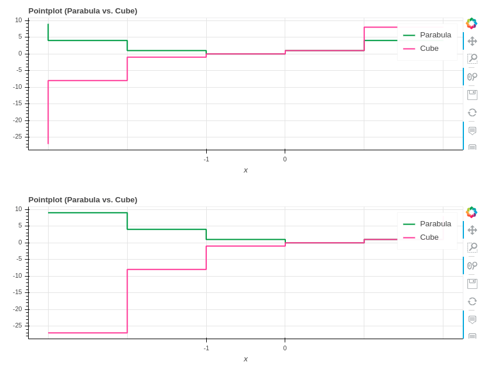


*Note that the step-plot API of Bokeh does so far not support a [hovertool functionality](https://github.com/bokeh/bokeh/issues/7419)*.

<br>

## Scatterplot

A basic **scatterplot** can be created using the *kind="scatter"* option. For **scatterplots**, the **x** and **y** parameters have to be specified and the following optional keyword argument is allowed:

* **category**: Determines the category column to use for coloring the scatter points


* **kwargs****: Optional keyword arguments of [bokeh.plotting.figure.scatter](https://bokeh.pydata.org/en/latest/docs/reference/plotting.html#bokeh.plotting.figure.Figure.scatter)


Note, that the **pandas.DataFrame.plot_bokeh()** method return per default a Bokeh figure, which can be embedded in Dashboard layouts with other figures and **Bokeh** objects (for more details about (sub)plot layouts and embedding the resulting Bokeh plots as HTML click [here](#Layouts)).

In the example below, we use the building *grid layout* support of **Pandas-Bokeh** to display both the DataFrame (embedded in a *Div*) and the resulting **scatterplot**:

```python
#Load Iris Dataset from Scikit Learn:
from sklearn.datasets import load_iris
iris = load_iris()
df = pd.DataFrame(iris["data"])
df.columns = iris["feature_names"]
df["species"] = iris["target"]
df["species"] = df["species"].map(dict(zip(range(3), iris["target_names"])))
df = df.sample(frac=1)

#Create Div with DataFrame:
from bokeh.models import Div
div_df = Div(text=df.head(10).to_html(index=False), width=550)

#Create Scatterplot:
p_scatter = df.plot_bokeh.scatter(
    x="petal length (cm)",
    y="sepal width (cm)",
    category="species",
    title="Iris DataSet Visualization",
    show_figure=False)

#Combine Div and Scatterplot via grid layout:
pandas_bokeh.plot_grid([[div_df, p_scatter]], plot_width=400, plot_height=350)
```
<p id="scatterplot_picture"> </p>

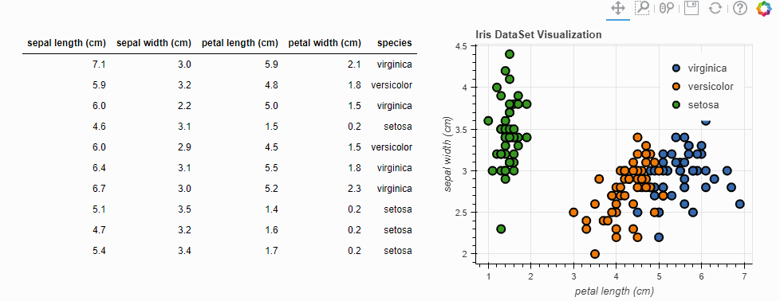

A possible optional keyword parameters that can be passed to [bokeh.plotting.figure.scatter](https://bokeh.pydata.org/en/latest/docs/reference/plotting.html#bokeh.plotting.figure.Figure.scatter) is **size**. Below, we use the *sepal length* of the Iris data as reference for the size:
```python
#Change one value to clearly see the effect of the size keyword
df.loc[13, "sepal length (cm)"] = 15     

#Make scatterplot:
p_scatter = df.plot_bokeh.scatter(
    x="petal length (cm)",
    y="sepal width (cm)",
    category="species",
    title="Iris DataSet Visualization",
    size="sepal length (cm)")
```


In this example you can see, that the additional dimension *sepal length* cannot be used to clearly differentiate between the *virginica* and *versicolor* species.

<br>

## Barplot

The **barplot** API has no special keyword arguments, but accepts optional **kwargs** of [bokeh.plotting.figure.vbar](https://bokeh.pydata.org/en/latest/docs/reference/plotting.html#bokeh.plotting.figure.Figure.vbar) like *alpha*. It uses per default the index for the bar categories (however, also columns can be used as x-axis category using the **x** argument).

```python
data = {
    'fruits':
    ['Apples', 'Pears', 'Nectarines', 'Plums', 'Grapes', 'Strawberries'],
    '2015': [2, 1, 4, 3, 2, 4],
    '2016': [5, 3, 3, 2, 4, 6],
    '2017': [3, 2, 4, 4, 5, 3]
}
df = pd.DataFrame(data).set_index("fruits")

p_bar = df.plot_bokeh.bar(
    ylabel="Price per Unit [€]", 
    title="Fruit prices per Year", 
    alpha=0.6)
```

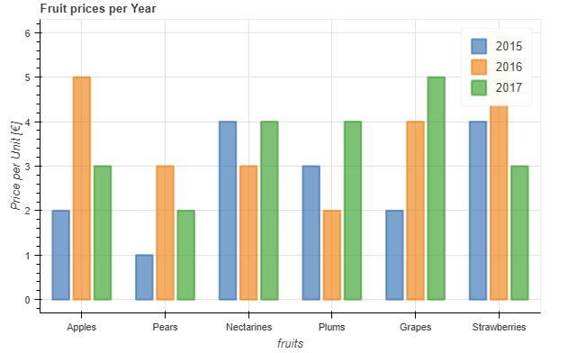

Using the **stacked** keyword argument you also maked stacked barplots:
```python
p_stacked_bar = df.plot_bokeh.bar(
    ylabel="Price per Unit [€]",
    title="Fruit prices per Year",
    stacked=True,
    alpha=0.6)
```


Also horizontal versions of the above barplot are supported with the keyword **kind="barh"** or the accessor **plot_bokeh.barh**. You can still specify a column of the DataFrame as the bar category via the **x** argument if you do not wish to use the index.
```python
#Reset index, such that "fruits" is now a column of the DataFrame:
df.reset_index(inplace=True)

#Create horizontal bar (via kind keyword):
p_hbar = df.plot_bokeh(
    kind="barh",
    x="fruits",
    xlabel="Price per Unit [€]",
    title="Fruit prices per Year",
    alpha=0.6,
    legend = "bottom_right",
    show_figure=False)

#Create stacked horizontal bar (via barh accessor):
p_stacked_hbar = df.plot_bokeh.barh(
    x="fruits",
    stacked=True,
    xlabel="Price per Unit [€]",
    title="Fruit prices per Year",
    alpha=0.6,
    legend = "bottom_right",
    show_figure=False)

#Plot all barplot examples in a grid:
pandas_bokeh.plot_grid([[p_bar, p_stacked_bar],
                        [p_hbar, p_stacked_hbar]], 
                       plot_width=450)
```


## Histogram

For drawing **histograms** (kind="hist"), **Pandas-Bokeh** has a lot of customization features. Optional keyword arguments for *histogram plots* are:
* **bins**: Determines bins to use for the histogram. If bins is an int, it defines the number of equal-width bins in the given range (10, by default). If bins is a sequence, it defines the bin edges, including the rightmost edge, allowing for non-uniform bin widths. If bins is a string, it defines the method used to calculate the optimal bin width, as defined by [histogram_bin_edges](https://docs.scipy.org/doc/numpy-1.15.1/reference/generated/numpy.histogram_bin_edges.html#numpy.histogram_bin_edges).
* **histogram_type**: Either *"sidebyside"*, *"topontop"* or *"stacked"*. Default: *"topontop"*
* **stacked**: Boolean that overrides the *histogram_type* as *"stacked"* if given. Default: *False*


* **kwargs****: Optional keyword arguments of [bokeh.plotting.figure.quad](https://bokeh.pydata.org/en/latest/docs/reference/plotting.html#bokeh.plotting.figure.Figure.quad)

Below examples of the different histogram types:
```python
import numpy as np

df_hist = pd.DataFrame({
    'a': np.random.randn(1000) + 1,
    'b': np.random.randn(1000),
    'c': np.random.randn(1000) - 1
    },
    columns=['a', 'b', 'c'])

#Top-on-Top Histogram (Default):
df_hist.plot_bokeh.hist(
    bins=np.linspace(-5, 5, 41),
    vertical_xlabel=True,
    hovertool=False,
    title="Normal distributions (Top-on-Top)",
    line_color="black")

#Side-by-Side Histogram (multiple bars share bin side-by-side) also accessible via
#kind="hist":
df_hist.plot_bokeh(
    kind="hist",
    bins=np.linspace(-5, 5, 41),
    histogram_type="sidebyside",
    vertical_xlabel=True,
    hovertool=False,
    title="Normal distributions (Side-by-Side)",
    line_color="black")

#Stacked histogram:
df_hist.plot_bokeh.hist(
    bins=np.linspace(-5, 5, 41),
    histogram_type="stacked",
    vertical_xlabel=True,
    hovertool=False,
    title="Normal distributions (Stacked)",
    line_color="black")
```


Further, advanced keyword arguments for histograms are:
* **weights**: A column of the DataFrame that is used as weight for the histogramm aggregation (see also [numpy.histogram](https://docs.scipy.org/doc/numpy-1.15.1/reference/generated/numpy.histogram.html))
* **normed**: If True, histogram values are normed to 1 (sum of histogram values=1). It is also possible to pass an integer, e.g. *normed=100* would result in a histogram with percentage y-axis (sum of histogram values=100). *Default: False*
* **cumulative**: If True, a cumulative histogram is shown. *Default: False*
* **show_average**: If True, the average of the histogram is also shown. *Default: False*

Their usage is shown in these examples:
```python
p_hist = df_hist.plot_bokeh.hist(
    y=["a", "b"],
    bins=np.arange(-4, 6.5, 0.5),
    normed=100,
    vertical_xlabel=True,
    ylabel="Share[%]",
    title="Normal distributions (normed)",
    show_average=True,
    xlim=(-4, 6),
    ylim=(0, 30),
    show_figure=False)

p_hist_cum = df_hist.plot_bokeh.hist(
    y=["a", "b"],
    bins=np.arange(-4, 6.5, 0.5),
    normed=100,
    cumulative=True,
    vertical_xlabel=True,
    ylabel="Share[%]",
    title="Normal distributions (normed & cumulative)",
    show_figure=False)

pandas_bokeh.plot_grid([[p_hist, p_hist_cum]], plot_width=450, plot_height=300)
```

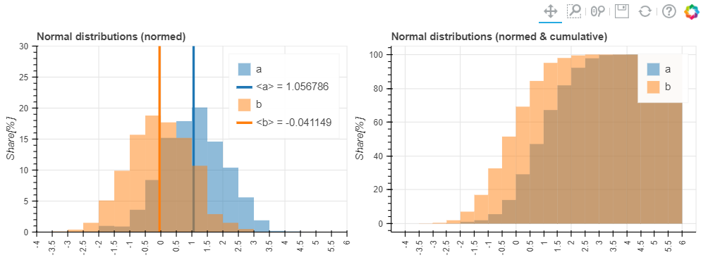

<br>

## Areaplot

Areaplot *(kind="area")* can be either drawn on top of each other or stacked. The important parameters are:
* **stacked**: If True, the areaplots are stacked. If False, plots are drawn on top of each other. *Default: False*


* **kwargs****: Optional keyword arguments of [bokeh.plotting.figure.patch](https://bokeh.pydata.org/en/latest/docs/reference/plotting.html#bokeh.plotting.figure.Figure.patch)

<br>

Let us consider the [energy consumption split by source](https://www.bp.com/en/global/corporate/energy-economics/statistical-review-of-world-energy.html) that can be downloaded as DataFrame via:
```python
df_energy = pd.read_csv(r"https://raw.githubusercontent.com/PatrikHlobil/Pandas-Bokeh/master/Documentation/Testdata/energy/energy.csv", 
parse_dates=["Year"])
df_energy.head()
```

<table  class="dataframe">  <thead>    <tr style="text-align: right;">      <th>Year</th>      <th>Oil</th>      <th>Gas</th>      <th>Coal</th>      <th>Nuclear Energy</th>      <th>Hydroelectricity</th>      <th>Other Renewable</th>    </tr>  </thead>  <tbody>    <tr>      <td>1970-01-01</td>      <td>2291.5</td>      <td>826.7</td>      <td>1467.3</td>      <td>17.7</td>      <td>265.8</td>      <td>5.8</td>    </tr>    <tr>      <td>1971-01-01</td>      <td>2427.7</td>      <td>884.8</td>      <td>1459.2</td>      <td>24.9</td>      <td>276.4</td>      <td>6.3</td>    </tr>    <tr>      <td>1972-01-01</td>      <td>2613.9</td>      <td>933.7</td>      <td>1475.7</td>      <td>34.1</td>      <td>288.9</td>      <td>6.8</td>    </tr>    <tr>      <td>1973-01-01</td>      <td>2818.1</td>      <td>978.0</td>      <td>1519.6</td>      <td>45.9</td>      <td>292.5</td>      <td>7.3</td>    </tr>    <tr>      <td>1974-01-01</td>      <td>2777.3</td>      <td>1001.9</td>      <td>1520.9</td>      <td>59.6</td>      <td>321.1</td>      <td>7.7</td>    </tr>  </tbody></table>
<br>

Creating the Areaplot can be achieved via:
```python
df_energy.plot_bokeh.area(
    x="Year",
    stacked=True,
    legend="top_left",
    colormap=["brown", "orange", "black", "grey", "blue", "green"],
    title="Worldwide energy consumption split by energy source",
    ylabel="Million tonnes oil equivalent",
    ylim=(0, 16000))
```


Note that the energy consumption of fossile energy is still increasing and renewable energy sources are still small in comparison 😢!!! However, when we norm the plot using the **normed** keyword, there is a clear trend towards renewable energies in the last decade:
```python
df_energy.plot_bokeh.area(
    x="Year",
    stacked=True,
    normed=100,
    legend="bottom_left",
    colormap=["brown", "orange", "black", "grey", "blue", "green"],
    title="Worldwide energy consumption split by energy source",
    ylabel="Million tonnes oil equivalent")
```


## Pieplot

For Pieplots, let us consider a dataset showing the results of all Bundestags elections in Germany since 2002:
```python
df_pie = pd.read_csv(r"https://raw.githubusercontent.com/PatrikHlobil/Pandas-Bokeh/master/Documentation/Testdata/Bundestagswahl/Bundestagswahl.csv")
df_pie
```
<table class="dataframe">  <thead>    <tr style="text-align: right;">      <th>Partei</th>      <th>2002</th>      <th>2005</th>      <th>2009</th>      <th>2013</th>      <th>2017</th>    </tr>  </thead>  <tbody>    <tr>      <td>CDU/CSU</td>      <td>38.5</td>      <td>35.2</td>      <td>33.8</td>      <td>41.5</td>      <td>32.9</td>    </tr>    <tr>      <td>SPD</td>      <td>38.5</td>      <td>34.2</td>      <td>23.0</td>      <td>25.7</td>      <td>20.5</td>    </tr>    <tr>      <td>FDP</td>      <td>7.4</td>      <td>9.8</td>      <td>14.6</td>      <td>4.8</td>      <td>10.7</td>    </tr>    <tr>      <td>Grünen</td>      <td>8.6</td>      <td>8.1</td>      <td>10.7</td>      <td>8.4</td>      <td>8.9</td>    </tr>    <tr>      <td>Linke/PDS</td>      <td>4.0</td>      <td>8.7</td>      <td>11.9</td>      <td>8.6</td>      <td>9.2</td>    </tr>    <tr>      <td>AfD</td>      <td>0.0</td>      <td>0.0</td>      <td>0.0</td>      <td>0.0</td>      <td>12.6</td>    </tr>    <tr>      <td>Sonstige</td>      <td>3.0</td>      <td>4.0</td>      <td>6.0</td>      <td>11.0</td>      <td>5.0</td>    </tr>  </tbody></table>

We can create a Pieplot of the last election in 2017 by specifying the "Partei" (german for party) column as the **x** column and the "2017" column as the y column for values:
```python
df_pie.plot_bokeh.pie(
    x="Partei",
    y="2017",
    colormap=["blue", "red", "yellow", "green", "purple", "orange", "grey"],
    title="Results of German Bundestag Election 2017",
    )
```


When you pass several columns to the **y** parameter (not providing the y-parameter assumes you plot all columns), multiple nested pieplots will be shown in one plot:
```python
df_pie.plot_bokeh.pie(
    x="Partei",
    colormap=["blue", "red", "yellow", "green", "purple", "orange", "grey"],
    title="Results of German Bundestag Elections [2002-2017]",
    line_color="grey")
```

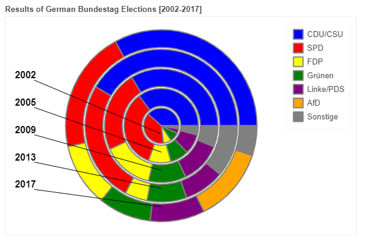


## Mapplot

The **mapplot** method of **Pandas-Bokeh** allows for plotting geographic points stored in a Pandas DataFrame on an interactive map. For more advanced **Geoplots** for line and polygon shapes have a look at the [Geoplots examples](#geoplots) for the GeoPandas API of **Pandas-Bokeh**. 

For **mapplots**, only (latitude, longitude) pairs in [geographic projection](https://en.wikipedia.org/wiki/Geographic_coordinate_system#Latitude_and_longitude) (WGS84) can be plotted on a map. The basic API has the following 2 base parameters:

* **x**: name of the *longitude* column of the DataFrame
* **y**: name of the *latitude* column of the DataFrame

The other optional keyword arguments are discussed in the section about the [GeoPandas API](#geoplots), e.g. **category** for coloring the points.

Below an example of plotting all cities for more than 1 million inhabitants:
```python
df_mapplot = pd.read_csv(r"https://raw.githubusercontent.com/PatrikHlobil/Pandas-Bokeh/master/Documentation/Testdata/populated%20places/populated_places.csv")
df_mapplot.head()
```

<table class="dataframe">
  <thead>
    <tr style="text-align: right;">
      <th>name</th>
      <th>pop_max</th>
      <th>latitude</th>
      <th>longitude</th>
      <th>size</th>
    </tr>
  </thead>
  <tbody>
    <tr>
      <td>Mesa</td>
      <td>1085394</td>
      <td>33.423915</td>
      <td>-111.736084</td>
      <td>1.085394</td>
    </tr>
    <tr>
      <td>Sharjah</td>
      <td>1103027</td>
      <td>25.371383</td>
      <td>55.406478</td>
      <td>1.103027</td>
    </tr>
    <tr>
      <td>Changwon</td>
      <td>1081499</td>
      <td>35.219102</td>
      <td>128.583562</td>
      <td>1.081499</td>
    </tr>
    <tr>
      <td>Sheffield</td>
      <td>1292900</td>
      <td>53.366677</td>
      <td>-1.499997</td>
      <td>1.292900</td>
    </tr>
    <tr>
      <td>Abbottabad</td>
      <td>1183647</td>
      <td>34.149503</td>
      <td>73.199501</td>
      <td>1.183647</td>
    </tr>
  </tbody>
</table>


```python
df_mapplot["size"] = df_mapplot["pop_max"] / 1000000
df_mapplot.plot_bokeh.map(
    x="longitude",
    y="latitude",
    hovertool_string="""<h2> @{name} </h2> 
    
                        <h3> Population: @{pop_max} </h3>""",
    tile_provider="STAMEN_TERRAIN_RETINA",
    size="size", 
    figsize=(900, 600),
    title="World cities with more than 1.000.000 inhabitants")
```

<p id="geoplots"> </p>


## Geoplots

**Pandas-Bokeh** also allows for interactive plotting of Maps using [GeoPandas](http://geopandas.org/) by providing a **geopandas.GeoDataFrame.plot_bokeh()** method.  It allows to plot the following geodata on a map :

* Points/MultiPoints
* Lines/MultiLines
* Polygons/MultiPolygons

**Note**: t is not possible to mix up the objects types, i.e. a GeoDataFrame with Points and Lines is for example not allowed. 

Les us start with a simple example using the ["World Borders Dataset"](http://thematicmapping.org/downloads/world_borders.php) . Let us first import all neccessary libraries and read the shapefile:
```python
import geopandas as gpd
import pandas as pd
import pandas_bokeh
pandas_bokeh.output_notebook()

#Read in GeoJSON from URL:
df_states = gpd.read_file(r"https://raw.githubusercontent.com/PatrikHlobil/Pandas-Bokeh/master/Documentation/Testdata/states/states.geojson")
df_states.head()
```

<table>  <thead>    <tr style="text-align: right;">      <th>STATE_NAME</th>      <th>REGION</th>      <th>POPESTIMATE2010</th>      <th>POPESTIMATE2011</th>      <th>POPESTIMATE2012</th>      <th>POPESTIMATE2013</th>      <th>POPESTIMATE2014</th>      <th>POPESTIMATE2015</th>      <th>POPESTIMATE2016</th>      <th>POPESTIMATE2017</th>      <th>geometry</th>    </tr>  </thead>  <tbody>    <tr>      <td>Hawaii</td>      <td>4</td>      <td>1363817</td>      <td>1378323</td>      <td>1392772</td>      <td>1408038</td>      <td>1417710</td>      <td>1426320</td>      <td>1428683</td>      <td>1427538</td>      <td>(POLYGON ((-160.0738033454681 22.0041773479577...</td>    </tr>    <tr>      <td>Washington</td>      <td>4</td>      <td>6741386</td>      <td>6819155</td>      <td>6890899</td>      <td>6963410</td>      <td>7046931</td>      <td>7152818</td>      <td>7280934</td>      <td>7405743</td>      <td>(POLYGON ((-122.4020153103835 48.2252163723779...</td>    </tr>    <tr>      <td>Montana</td>      <td>4</td>      <td>990507</td>      <td>996866</td>      <td>1003522</td>      <td>1011921</td>      <td>1019931</td>      <td>1028317</td>      <td>1038656</td>      <td>1050493</td>      <td>POLYGON ((-111.4754253002074 44.70216236909688...</td>    </tr>    <tr>      <td>Maine</td>      <td>1</td>      <td>1327568</td>      <td>1327968</td>      <td>1328101</td>      <td>1327975</td>      <td>1328903</td>      <td>1327787</td>      <td>1330232</td>      <td>1335907</td>      <td>(POLYGON ((-69.77727626137293 44.0741483685119...</td>    </tr>    <tr>      <td>North Dakota</td>      <td>2</td>      <td>674518</td>      <td>684830</td>      <td>701380</td>      <td>722908</td>      <td>738658</td>      <td>754859</td>      <td>755548</td>      <td>755393</td>      <td>POLYGON ((-98.73043728833767 45.93827137024809...</td>    </tr>  </tbody></table>

Plotting the data on a map is as simple as calling:

```python
df_states.plot_bokeh(simplify_shapes=10000)
```


We also passed the optional parameter **simplify_shapes** (~meter) to improve plotting performance (for a reference see [shapely.object.simplify](https://shapely.readthedocs.io/en/stable/manual.html#object.simplify)). The above geolayer thus has an accuracy of about 10km.

Many keyword arguments like *xlabel, ylabel, xlim, ylim, title, colormap, hovertool, zooming, panning, ...* for costumizing the plot are also available for the geoplotting API and can be uses as in the examples shown above. There are however also many other options especially for plotting geodata:
* **hovertool_columns**: Specify column names, for which values should be shown in hovertool
* **hovertool_string**: If specified, this string will be used for the hovertool (@{column} will be replaced by the value of the column for the element the mouse hovers over, see also [Bokeh documentation](https://bokeh.pydata.org/en/latest/docs/user_guide/tools.html#custom-tooltip))
* **colormap_uselog**: If set *True*, the colormapper is using a logscale. *Default: False*
* **colormap_range**: Specify the value range of the colormapper via (min, max) tuple
* **tile_provider**: Define build-in tile provider for background maps. Possible values: *None, 'CARTODBPOSITRON', 'CARTODBPOSITRON_RETINA', 'STAMEN_TERRAIN', 'STAMEN_TERRAIN_RETINA', 'STAMEN_TONER', 'STAMEN_TONER_BACKGROUND', 'STAMEN_TONER_LABELS'. Default: CARTODBPOSITRON_RETINA* 
* **tile_provider_url**: An arbitraty tile_provider_url of the form '<url>/{Z}/{X}/{Y}*.png' can be passed to be used as background map. 
* **tile_attribution**: String (also HTML accepted) for showing attribution for tile source in the lower right corner
* **tile_alpha**: Sets the alpha value of the background tile between [0, 1].  *Default: 1*

One of the most common usage of map plots are [choropleth maps](https://en.wikipedia.org/wiki/Choropleth_map), where the color of a the objects is determined by the property of the object itself. There are 3 ways of drawing choropleth maps using **Pandas-Bokeh**, which are described below.

### Categories
This is the simplest way. Just provide the **category** keyword for the selection of the property column:
* **category**: Specifies the column of the GeoDataFrame that should be used to draw a [choropleth map](https://en.wikipedia.org/wiki/Choropleth_map)
* **show_colorbar**: Whether or not to show a colorbar for categorical plots. *Default: True*
    
Let us now draw the regions as a **choropleth plot** using the **category** keyword (at the moment, only numerical columns are supported for choropleth plots):
```python
df_states.plot_bokeh(
    figsize=(900, 600),
    simplify_shapes=5000,
    category="REGION",
    show_colorbar=False,
    colormap=["blue", "yellow", "green", "red"],
    hovertool_columns=["STATE_NAME", "REGION"],
    tile_provider="STAMEN_TERRAIN_RETINA")
```

When hovering over the states, the state-name and the region are shown as specified in the **hovertool_columns** argument.


<p id="Dropdown"></p>

### Dropdown
By passing a *list of column names* of the GeoDataFrame as the **dropdown** keyword argument, a dropdown menu is shown above the map. This dropdown menu can be used to select the choropleth layer by the user. :
```python
df_states["STATE_NAME_SMALL"] = df_states["STATE_NAME"].str.lower()

df_states.plot_bokeh(
    figsize=(900, 600),
    simplify_shapes=5000,
    dropdown=["POPESTIMATE2010", "POPESTIMATE2017"],
    colormap="Viridis",
    hovertool_string="""
                        </img>
                
                        <h2>  @STATE_NAME </h2>
                        <h3> 2010: @POPESTIMATE2010 </h3>
                        <h3> 2017: @POPESTIMATE2017 </h3>""",
    tile_provider_url=r"http://c.tile.stamen.com/watercolor/{Z}/{X}/{Y}.jpg",
    tile_attribution='Map tiles by <a href="http://stamen.com">Stamen Design</a>, under <a href="http://creativecommons.org/licenses/by/3.0">CC BY 3.0</a>. Data by <a href="http://openstreetmap.org">OpenStreetMap</a>, under <a href="http://www.openstreetmap.org/copyright">ODbL</a>.'
    )
```

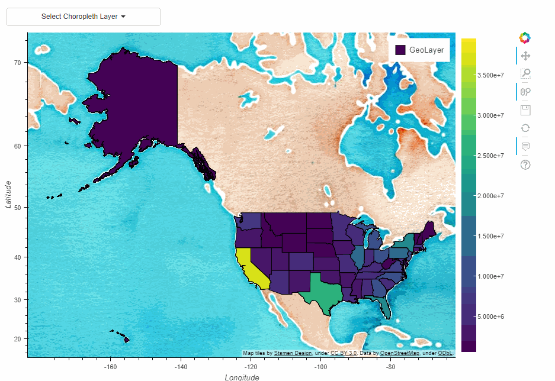

Using **hovertool_string**, one can pass a string that can contain arbitrary HTML elements (including divs, images, ...) that is shown when hovering over the geographies (@{column} will be replaced by the value of the column for the element the mouse hovers over, see also [Bokeh documentation](https://bokeh.pydata.org/en/latest/docs/user_guide/tools.html#custom-tooltip)).

Here, we also used an OSM tile server with watercolor style via **tile_provider_url** and added the attribution via **tile_attribution**.


### Sliders

Another option for interactive *choropleth* maps is the **slider** implementation of *Pandas-Bokeh*. The possible keyword arguments are here:

* **slider**: By passing a *list of column names* of the GeoDataFrame, a slider can be used to . This dropdown menu can be used to select the choropleth layer by the user.
* **slider_range**: Pass a range (or numpy.arange) of numbers object to relate the sliders values with the *slider* columns. By passing range(0,10), the slider will have values [0, 1, 2, ..., 9], when passing numpy.arange(3,5,0.5), the slider will have values [3, 3.5, 4, 4.5]. *Default: range(0, len(slider))*
* **slider_name**: Specifies the title of the slider. *Default is an empty string.*

This can be used to display the change in population relative to the year 2010:
```python
#Calculate change of population relative to 2010:
for i in range(8):
    df_states["Delta_Population_201%d"%i] = ((df_states["POPESTIMATE201%d"%i] / df_states["POPESTIMATE2010"]) -1 ) * 100

#Specify slider columns:
slider_columns = ["Delta_Population_201%d"%i for i in range(8)]

#Specify slider-range (Maps "Delta_Population_2010" -> 2010, 
#                           "Delta_Population_2011" -> 2011, ...):
slider_range = range(2010, 2018)

#Make slider plot:
df_states.plot_bokeh(
    figsize=(900, 600),
    simplify_shapes=5000,
    slider=slider_columns,
    slider_range=slider_range,
    slider_name="Year", 
    colormap="Inferno",
    hovertool_columns=["STATE_NAME"] + slider_columns,
    title="Change of Population [%]")
```
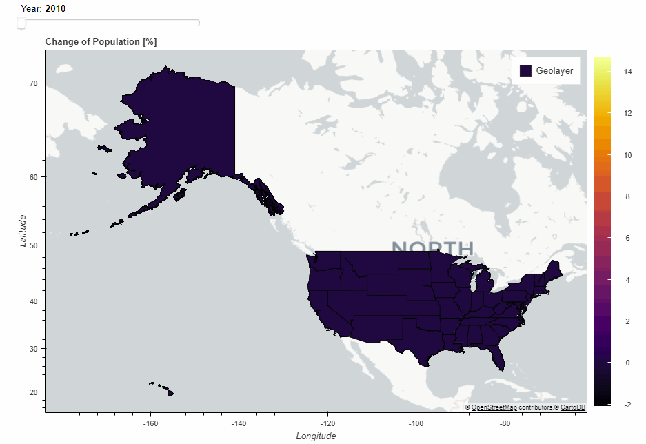

<br>
<br>

### Plot multiple geolayers

If you wish to display multiple geolayers, you can pass the *Bokeh figure of a Pandas-Bokeh plot* via the **figure** keyword to the next **plot_bokeh()** call:
```python
import geopandas as gpd
import pandas_bokeh
pandas_bokeh.output_notebook()

# Read in GeoJSONs from URL:
df_states = gpd.read_file(r"https://raw.githubusercontent.com/PatrikHlobil/Pandas-Bokeh/master/Documentation/Testdata/states/states.geojson")
df_cities = gpd.read_file(
    r"https://raw.githubusercontent.com/PatrikHlobil/Pandas-Bokeh/master/Documentation/Testdata/populated%20places/ne_10m_populated_places_simple_bigcities.geojson"
)
df_cities["size"] = df_cities.pop_max / 400000

#Plot shapes of US states (pass figure options to this initial plot):
figure = df_states.plot_bokeh(
    figsize=(800, 450),
    simplify_shapes=10000,
    show_figure=False,
    xlim=[-170, -80],
    ylim=[10, 70],
    category="REGION",
    colormap="Dark2",
    legend="States",
    show_colorbar=False,
)

#Plot cities as points on top of the US states layer by passing the figure:
df_cities.plot_bokeh(
    figure=figure,         # <== pass figure here!
    category="pop_max",
    colormap="Viridis",
    colormap_uselog=True,
    size="size",
    hovertool_string="""<h1>@name</h1>
                        <h3>Population: @pop_max </h3>""",
    marker="inverted_triangle",
    legend="Cities",
)

```


---

### Point & Line plots:

Below, you can see an example that use **Pandas-Bokeh** to plot point data on a map. The plot shows all cities with a population larger than 1.000.000. For point plots, you can select the **marker** as keyword argument (since it is passed to [bokeh.plotting.figure.scatter](http://bokeh.pydata.org/en/latest/docs/reference/plotting.html#bokeh.plotting.figure.Figure.scatter)). [Here](https://bokeh.pydata.org/en/latest/docs/gallery/markers.html) an overview of all available marker types:
```python
gdf = gpd.read_file(r"https://raw.githubusercontent.com/PatrikHlobil/Pandas-Bokeh/master/Documentation/Testdata/populated%20places/ne_10m_populated_places_simple_bigcities.geojson")
gdf["size"] = gdf.pop_max / 400000

gdf.plot_bokeh(
    category="pop_max",
    colormap="Viridis",
    colormap_uselog=True,
    size="size",
    hovertool_string="""<h1>@name</h1>
                        <h3>Population: @pop_max </h3>""",
    xlim=[-15, 35],
    ylim=[30,60],
    marker="inverted_triangle");
```


In a similar way, also GeoDataFrames with (multi)line shapes can be drawn using **Pandas-Bokeh**.

<br>

---

### Colorbar formatting:

If you want to display the numerical labels on your colorbar with an alternative to the scientific format, you
can pass in a one of the [bokeh number string formats](https://bokeh.pydata.org/en/latest/_modules/bokeh/models/formatters.html#NumeralTickFormatter)
or an instance of one of the [bokeh.models.formatters](https://bokeh.pydata.org/en/latest/docs/reference/models/formatters.html) to the `colorbar_tick_format` argument
in the geoplot

An example of using the string format argument:

```python
df_states = gpd.read_file(r"https://raw.githubusercontent.com/PatrikHlobil/Pandas-Bokeh/master/Documentation/Testdata/states/states.geojson")

df_states["STATE_NAME_SMALL"] = df_states["STATE_NAME"].str.lower()

# pass in a string format to colorbar_tick_format to display the ticks as 10m rather than 1e7
df_states.plot_bokeh(
    figsize=(900, 600),
    category="POPESTIMATE2017",
    simplify_shapes=5000,    
    colormap="Inferno",
    colormap_uselog=True,
    colorbar_tick_format="0.0a")
```


An example of using the bokeh `PrintfTickFormatter`:

```python
df_states = gpd.read_file(r"https://raw.githubusercontent.com/PatrikHlobil/Pandas-Bokeh/master/Documentation/Testdata/states/states.geojson")

df_states["STATE_NAME_SMALL"] = df_states["STATE_NAME"].str.lower()

for i in range(8):
    df_states["Delta_Population_201%d"%i] = ((df_states["POPESTIMATE201%d"%i] / df_states["POPESTIMATE2010"]) -1 ) * 100

# pass in a PrintfTickFormatter instance colorbar_tick_format to display the ticks with 2 decimal places  
df_states.plot_bokeh(
    figsize=(900, 600),
    category="Delta_Population_2017",
    simplify_shapes=5000,    
    colormap="Inferno",
    colorbar_tick_format=PrintfTickFormatter(format="%4.2f"))
```


<br>

<p id="Layouts"></p>

## Outputs, Formatting & Layouts

<p id="output_options"></p>

### Output options

The **pandas.DataFrame.plot_bokeh** API has the following additional keyword arguments:

* **show_figure**: If True, the resulting figure is shown (either in the notebook or exported and shown as HTML file, see [Basics](#Basics). If False, None is returned. *Default: True*
* **return_html**: If True, the method call returns an HTML string that contains all **Bokeh** CSS&JS resources and the figure embedded in a div. This HTML representation of the plot can be used for embedding the plot in an HTML document. *Default: False*

If you have a **Bokeh figure or layout**, you can also use the **pandas_bokeh.embedded_html** function to generate an embeddable HTML representation of the plot. This can be included into any valid HTML (note that this is not possible directly with the HTML generated by the [pandas_bokeh.output_file](#output_file) output option, because it includes an HTML header). Let us consider the following simple example:

```python
#Import Pandas and Pandas-Bokeh (if you do not specify an output option, the standard is
#output_file):
import pandas as pd
import pandas_bokeh

#Create DataFrame to Plot:
import numpy as np
x = np.arange(-10, 10, 0.1)
sin = np.sin(x)
cos = np.cos(x)
tan = np.tan(x)
df = pd.DataFrame({"x": x, "sin(x)": sin, "cos(x)": cos, "tan(x)": tan})

#Make Bokeh plot from DataFrame using Pandas-Bokeh. Do not show the plot, but export
#it to an embeddable HTML string:
html_plot = df.plot_bokeh(
    kind="line",
    x="x",
    y=["sin(x)", "cos(x)", "tan(x)"],
    xticks=range(-20, 20),
    title="Trigonometric functions",
    show_figure=False,
    return_html=True,
    ylim=(-1.5, 1.5))

#Write some HTML and embed the HTML plot below it. For production use, please use
#Templates and the awesome Jinja library.
html = r"""
<script type="text/x-mathjax-config">
  MathJax.Hub.Config({tex2jax: {inlineMath: [['$','$'], ['\\(','\\)']]}});
</script>
<script type="text/javascript"
  src="http://cdn.mathjax.org/mathjax/latest/MathJax.js?config=TeX-AMS-MML_HTMLorMML">
</script>

<h1> Trigonometric functions </h1>

<p> The basic trigonometric functions are:</p>

<p>$ sin(x) $</p>
<p>$ cos(x) $</p>
<p>$ tan(x) = \frac{sin(x)}{cos(x)}$</p>

<p>Below is a plot that shows them</p>

""" + html_plot

#Export the HTML string to an external HTML file and show it:
with open("test.html" , "w") as f:
    f.write(html)
    
import webbrowser
webbrowser.open("test.html")
```

This code will open up a webbrowser and show the following page. As you can see, the interactive Bokeh plot is embedded nicely into the HTML layout. The **return_html** option is ideal for the use in a templating engine like [Jinja](http://jinja.pocoo.org/). 

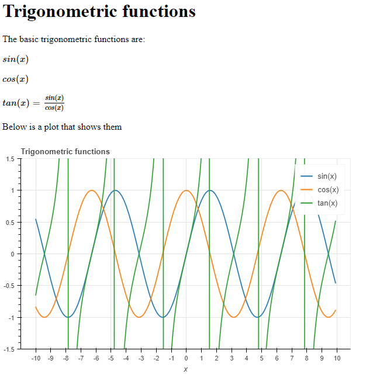

### Auto Scaling Plots

For single plots that have a number of x axis values or for larger monitors, you can auto scale the figure to the width of the entire jupyter cell by setting the `sizing_mode` parameter.

```python
df = pd.DataFrame(np.random.rand(10, 4), columns=['a', 'b', 'c', 'd'])

df.plot_bokeh(kind="bar", figsize=(500, 200), sizing_mode="scale_width")
```


The `figsize` parameter can be used to change the height and width as well as act as a scaling multiplier against the axis that is not being scaled.

<p id="number_formats"></p>

### Number formats

To change the formats of numbers in the hovertool, use the **number_format** keyword argument. For a documentation about the format to pass, have a look at the [Bokeh documentation](https://bokeh.pydata.org/en/latest/docs/reference/models/formatters.html#bokeh.models.formatters.NumeralTickFormatter.format).Let us consider some examples for the number **3.141592653589793**:

| Format | Output |
|--------|--------|
| 0      | 3      |
| 0.000  | 3.141  |
| 0.00 \$ | 3.14 \$ |


This number format will be applied to all numeric columns of the hovertool. If you want to make a very custom or complicated hovertool, you should probably use the **hovertool_string** keyword argument, see e.g. [this example](#hovertool_string_example). Below, we use the **number_format** parameter to specify the "Stock Price" format to 2 decimal digits and an additional \$ sign.
```python
import numpy as np

#Lineplot:
np.random.seed(42)
df = pd.DataFrame({
    "Google": np.random.randn(1000) + 0.2,
    "Apple": np.random.randn(1000) + 0.17
},
                  index=pd.date_range('1/1/2000', periods=1000))
df = df.cumsum()
df = df + 50
df.plot_bokeh(
    kind="line",
    title="Apple vs Google",
    xlabel="Date",
    ylabel="Stock price [$]",
    yticks=[0, 100, 200, 300, 400],
    ylim=(0, 400),
    colormap=["red", "blue"],
    number_format="1.00 $")
```
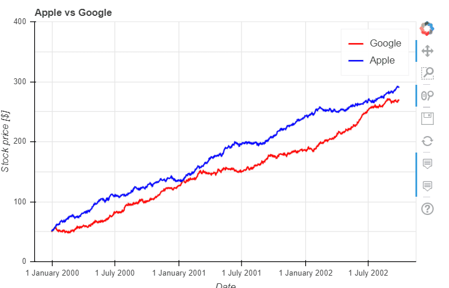

#### Suppress scientific notation for axes

If you want to suppress the scientific notation for axes, you can use the **disable_scientific_axes** parameter, which accepts one of *"x", "y", "xy"*:

```python
df = pd.DataFrame({"Animal": ["Mouse", "Rabbit", "Dog", "Tiger", "Elefant", "Wale"],
                   "Weight [g]": [19, 3000, 40000, 200000, 6000000, 50000000]})
p_scientific = df.plot_bokeh(x="Animal", y="Weight [g]", show_figure=False)
p_non_scientific = df.plot_bokeh(x="Animal", y="Weight [g]", disable_scientific_axes="y", show_figure=False,)
pandas_bokeh.plot_grid([[p_scientific, p_non_scientific]], plot_width = 450)
```


<p id="dashboard_layouts"></p>

### Dashboard Layouts

As shown in the [Scatterplot Example](#scatterplot_picture), combining plots with  plots or other HTML elements is straighforward in **Pandas-Bokeh** due to the layout capabilities of [Bokeh](https://bokeh.pydata.org/en/latest/docs/user_guide/layout.html). The easiest way to generate a dashboard layout is using the **pandas_bokeh.plot_grid** method (which is an extension of [bokeh.layouts.gridplot](https://bokeh.pydata.org/en/latest/docs/reference/layouts.html#bokeh.layouts.gridplot)):

```python
import pandas as pd
import numpy as np
import pandas_bokeh
pandas_bokeh.output_notebook()

#Barplot:
data = {
    'fruits':
    ['Apples', 'Pears', 'Nectarines', 'Plums', 'Grapes', 'Strawberries'],
    '2015': [2, 1, 4, 3, 2, 4],
    '2016': [5, 3, 3, 2, 4, 6],
    '2017': [3, 2, 4, 4, 5, 3]
}
df = pd.DataFrame(data).set_index("fruits")
p_bar = df.plot_bokeh(
    kind="bar",
    ylabel="Price per Unit [€]",
    title="Fruit prices per Year",
    show_figure=False)

#Lineplot:
np.random.seed(42)
df = pd.DataFrame({
    "Google": np.random.randn(1000) + 0.2,
    "Apple": np.random.randn(1000) + 0.17
},
                  index=pd.date_range('1/1/2000', periods=1000))
df = df.cumsum()
df = df + 50
p_line = df.plot_bokeh(
    kind="line",
    title="Apple vs Google",
    xlabel="Date",
    ylabel="Stock price [$]",
    yticks=[0, 100, 200, 300, 400],
    ylim=(0, 400),
    colormap=["red", "blue"],
    show_figure=False)

#Scatterplot:
from sklearn.datasets import load_iris
iris = load_iris()
df = pd.DataFrame(iris["data"])
df.columns = iris["feature_names"]
df["species"] = iris["target"]
df["species"] = df["species"].map(dict(zip(range(3), iris["target_names"])))
p_scatter = df.plot_bokeh(
    kind="scatter",
    x="petal length (cm)",
    y="sepal width (cm)",
    category="species",
    title="Iris DataSet Visus
    alization",
    show_figure=False)

#Histogram:
df_hist = pd.DataFrame({
    'a': np.random.randn(1000) + 1,
    'b': np.random.randn(1000),
    'c': np.random.randn(1000) - 1
},
                       columns=['a', 'b', 'c'])

p_hist = df_hist.plot_bokeh(
    kind="hist",
    bins=np.arange(-6, 6.5, 0.5),
    vertical_xlabel=True,
    normed=100,
    hovertool=False,
    title="Normal distributions",
    show_figure=False)

#Make Dashboard with Grid Layout:
pandas_bokeh.plot_grid([[p_line, p_bar], 
                        [p_scatter, p_hist]], plot_width=450)
```


Using a combination of *row* and *column* elements (see also [Bokeh Layouts](https://bokeh.pydata.org/en/latest/docs/user_guide/layout.html)) allow for a very easy general arrangement of elements. An alternative layout to the one above is:

```python
p_line.plot_width = 900
p_hist.plot_width = 900

layout = pandas_bokeh.column(p_line,
                pandas_bokeh.row(p_scatter, p_bar),
                p_hist)

pandas_bokeh.show(layout)
```

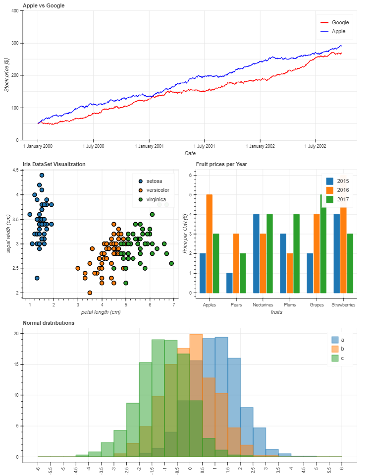


<br>

---

<br>

<p id="releasenotes"> </p>

# Release Notes

## 0.0.1

In this early version, the following plot types are supported:

* line
* point
* scatter
* bar
* histogram

In the near future many more will be implemented as horizontal barplot, boxplots,pie-charts, etc.

**Pandas-Bokeh** is a high-level API for *Bokeh*. Nevertheless there are many options for customizing the plots, for example:

* **figsize**: Choose width & height of the plot
* **title**: Sets title of the plot
* **xlim**/**ylim**: Set visibler range of plot for x- and y-axis (also works for *datetime x-axis*)
* **xlabel**/**ylabel**: Set x- and y-labels
* **logx**/**logy**: Set log-scale on x-/y-axis
* **xticks**/**yticks**: Explicitly set the ticks on the axes
* **colormap**: Defines the colors to plot. Can be either a list of colors or the name of a [Bokeh color palette](https://bokeh.pydata.org/en/latest/docs/reference/palettes.html)
* **hovertool**: If True a Hovertool is active, else if False no Hovertool is drawn.

Plots like scatterplot or histogram also have many more additional customization options.

## 0.0.2:

**Changes:**

* Fixed Error when importing **Pandas-Bokeh** in Python 2.7 
* Small refactoring and *Black* code formatting

## 0.1

**Changes:**

### General
* WebGL now as plotting backend as default 
* Code Refactoring & many bugfixes
* Added panning/zooming keyword options
* Toolbar now visible per default
* Kwargs names are checked in columns of DataFrame/Series and kept if there is a match, such that additional keyword arguments can be used to specify for example line_width or alpha value of plots
* Improved Functionalities (row, column) for **Pandas-Bokeh** Layouts
* Added <hovertool_string> for providing an [HTML string to the hovertool](https://bokeh.pydata.org/en/latest/docs/user_guide/tools.html#custom-tooltip)
* Many additional customization arguments

#### DataFrames
* Additional plot types:
    * areaplots (with **stacked** and **normed** kwargs)
    * horizontal & stacked barplots 
    * piecharts
    * mapplot
* Added accessors similar to the pandas.DataFrame.plot API:
  * ```df.plot_bokeh(kind="line", ...)``` → ```df.plot_bokeh.line(...)```
  * ```df.plot_bokeh(kind="bar", ...)``` → ```df.plot_bokeh.bar(...)```
  * ```df.plot_bokeh(kind="hist", ...)``` → ```df.plot_bokeh.hist(...)```
  * ...
* Smarter x-axis formatting for barplots when using datetimes
* Histogram <bins> parameter also accepts integers (to specify number of bins)
* Added support for categorical x-axis for all plot types (line, scatter, area, ...)
* Smarter autodetection of x- and y-labels

#### GeoDataFrames
* Added <tile_attribution> & <tile_alpha> parameter for background tiles of geoplots
* Support for xlim & ylim in WGS84 (Latitude/Longitude) for geoplots
* Greatly Improved performance for Polygon Geoplots 


## 0.1.1

* Refactoring of mapplot API (calls GeoPandas API of Pandas-Bokeh), such that all options of GeoPandas.GeoDataFrame.plot_bokeh are available.
* Allow passing a Pandas_Bokeh figure to overlay geoplots (not fully supported for category/dropdown/slider yet)
* Bug Fix for new **Pandas 0.24** release
* Implementation of first tests 

## 0.2

* **PySpark** support
* **Zeppelin Notebooks** support
* Added "disable_scientific_axes" option for Plots
* Bugfixes
* Implementation of **number_format** keyword for line, scatterplots
* Official support also for Python 3.4 & 3.5 

## 0.3

* Official Pandas backend switch support for pandas >= 0.25
* Add **stepplot**
* Add support for colormap ticker formatting in Geoplots
* Support for multipolygons & holes in Geoplots
* Bugfixes
* conda support

## 0.4</td>      <td>

* Rangetool support
* Autoscaling support using the **sizing_mode** keyword
* Bugfixes 
