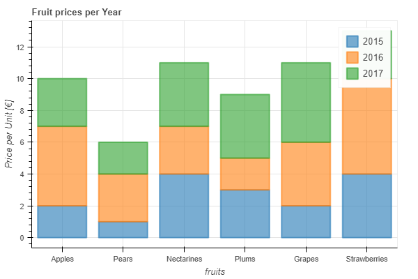
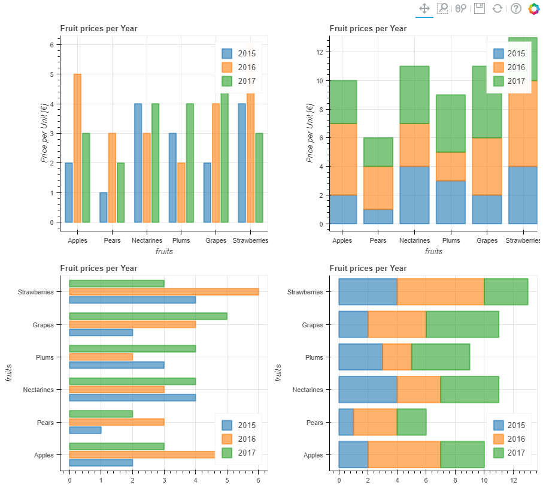
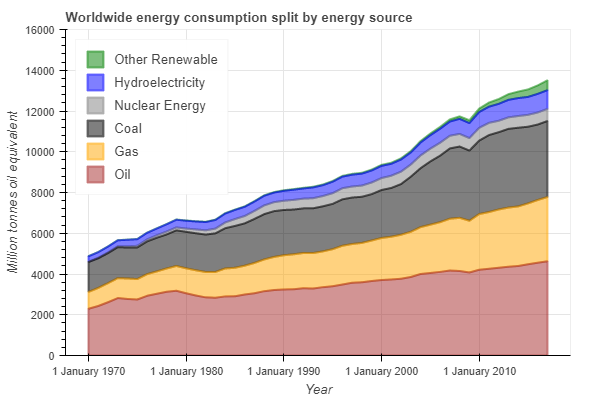
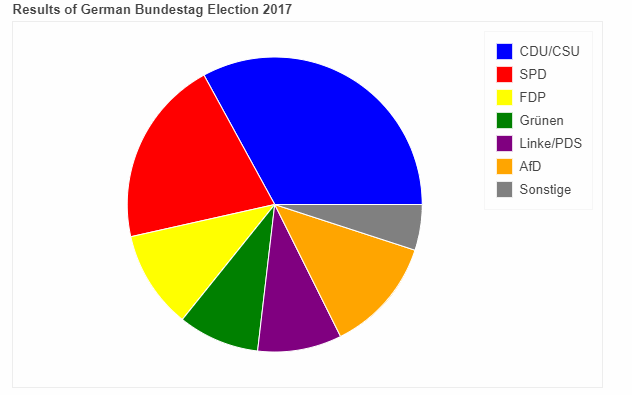

# Pandas Bokeh

**Pandas Bokeh** provides a [Bokeh](https://bokeh.pydata.org/en/latest/) plotting backend for [Pandas](https://pandas.pydata.org/) and [GeoPandas](http://geopandas.org/), similar to the already existing [Visualization](https://pandas.pydata.org/pandas-docs/stable/visualization.html) feature of Pandas. Importing the library adds a complementary plotting method ***plot_bokeh()*** on **DataFrames** and **Series** (and also on **GeoDataFrames**).

With **Pandas Bokeh**, creating stunning, interactive, HTML-based visualization is as easy as calling:
```python
df.plot_bokeh()
```

For more information have a look at the [Examples](#Examples) below or at  notebooks on the [Github Repository](https://github.com/PatrikHlobil/Pandas-Bokeh/tree/master/Documentation) of this project. 


<br>

## Installation

You can install **Pandas Bokeh** from [PyPI](https://pypi.org/project/pandas-bokeh/) via *pip*:

    pip install pandas-bokeh

**Pandas Bokeh** is supported on Python 2.7, as well as Python 3.6 and above.

<br>

## How To Use

<p id="Basics"> </p>

The **Pandas-Bokeh** library should be imported after **Pandas**. After the import, one should define the plotting output, which can be:

* **pandas_bokeh.output_notebook()**: Embeds the Plots in the cell outputs of the notebook. Ideal when working in Jupyter Notebooks.
* **pandas_bokeh.output_file(filename)**: Exports the plot to the provided filename as an HTML.

For more details about the plotting outputs, see the reference [here](#Layouts) or the [Bokeh documentation](https://bokeh.pydata.org/en/latest/docs/user_guide/quickstart.html#getting-started).

### Notebook output (see also [bokeh.io.output_notebook](https://bokeh.pydata.org/en/latest/docs/reference/io.html#bokeh.io.output_notebook))

```python
import pandas as pd
import pandas_bokeh
pandas_bokeh.output_notebook()
```

<p id="output_file"> </p>

### File output to "Interactive Plot.html" (see also [bokeh.io.output_file](https://bokeh.pydata.org/en/latest/docs/reference/io.html#bokeh.io.output_file))

```python
import pandas as pd
import pandas_bokeh
pandas_bokeh.output_file("Interactive Plot.html")
```

<br>

<p id="Examples"></p>

## Lineplot

### Basic Lineplot

This simple **lineplot** already contains various interactive elements:

* a pannable and zoomable (zoom in plotarea and zoom on axis) plot
* by clicking on the legend elements, one can hide and show the individual lines
* a Hovertool for the plotted lines

**Note**: If the **x** parameter is not specified, the index is used for the x-values of the plot.

```python
import numpy as np

np.random.seed(42)
df = pd.DataFrame({"Google": np.random.randn(1000)+0.2, 
                   "Apple": np.random.randn(1000)+0.17}, 
                   index=pd.date_range('1/1/2000', periods=1000))
df = df.cumsum()
df = df + 50
df.plot_bokeh(kind="line")
```


#### Advanced Lineplot

There are various optional parameters to tune the plots, for example:

* **kind**: Which kind of plot should be produced. Currently supported are: *"line", "point", "scatter", "bar"* and *"histogram"*. In the near future many more will be implemented as horizontal barplot, boxplots, pie-charts, etc.
* **figsize**: Choose width & height of the plot
* **title**: Sets title of the plot
* **xlim**/**ylim**: Set visibler range of plot for x- and y-axis (also works for *datetime x-axis*)
* **xlabel**/**ylabel**: Set x- and y-labels
* **logx**/**logy**: Set log-scale on x-/y-axis
* **xticks**/**yticks**: Explicitly set the ticks on the axes
* **color**: Defines a single color for a plot.
* **colormap**: Defines the colors to plot. Can be either a list of colors or the name of a [Bokeh color palette](https://bokeh.pydata.org/en/latest/docs/reference/palettes.html)
* **hovertool**: If True a Hovertool is active, else if False no Hovertool is drawn.


* **kwargs****: Optional keyword arguments of [bokeh.plotting.figure.line](https://bokeh.pydata.org/en/latest/docs/reference/plotting.html#bokeh.plotting.figure.Figure.line)


Try them out to get a feeling for the effects. Let us consider now:

```python
df.plot_bokeh(
    kind="line",
    figsize=(800, 450),
    title="Apple vs Google",
    xlabel="Date",
    ylabel="Stock price [$]",
    yticks=[0,100,200,300,400],
    ylim=(0,400),
    colormap=["red", "blue"])
```


#### Lineplot with data points

For **lineplots**, as for many other plot-kinds, there are some special keyword arguments that only work for this plotting type. For lineplots, these are:

* **plot_data_points**: Plot also the data points on the lines
* **plot_data_points_size**: Determines the size of the data points
* **marker**: Defines the point type *(Default: "circle")*. Possible values are: 'circle', 'square', 'triangle', 'asterisk', 'circle_x', 'square_x', 'inverted_triangle', 'x', 'circle_cross', 'square_cross', 'diamond', 'cross'


* **kwargs****: Optional keyword arguments of [bokeh.plotting.figure.line](https://bokeh.pydata.org/en/latest/docs/reference/plotting.html#bokeh.plotting.figure.Figure.line)

Let us use this information to have another version of the same plot:

```python
df.plot_bokeh(
    kind="line",
    figsize=(800, 450),
    title="Apple vs Google",
    xlabel="Date",
    ylabel="Stock price [$]",
    yticks=[0,100,200,300,400],
    ylim=(100,200),
    xlim=("2001-01-01","2001-02-01"),
    colormap=["red", "blue"],
    plot_data_points=True,
    plot_data_points_size=10,
    marker="asterisk",
    toolbar_location="right"
)
```


<br>

## Pointplot

If you just wish to draw the date points for curves, the **pointplot** option is the right choice. It also accepts the **kwargs** of [bokeh.plotting.figure.scatter](https://bokeh.pydata.org/en/latest/docs/reference/plotting.html#bokeh.plotting.figure.Figure.scatter) like *marker* or *size*:

```python
import numpy as np

x = np.arange(-3, 3, 0.1)
y2 = x**2
y3 = x**3
df = pd.DataFrame({"x": x, "Parabula": y2, "Cube": y3})
df.plot_bokeh(
    kind="point",
    x="x",
    xticks=range(-3, 4),
    size=5,
    colormap=["#009933", "#ff3399"],
    title="Pointplot (Parabula vs. Cube)",
    marker="x")
```


<br>

## Scatterplot

A basic **scatterplot** can be created using the *kind="scatter"* option. For **scatterplots**, the **x** and **y** parameters have to be specified and the following optional keyword argument is allowed:

* **category**: Determines the category column to use for coloring the scatter points


* **kwargs****: Optional keyword arguments of [bokeh.plotting.figure.scatter](https://bokeh.pydata.org/en/latest/docs/reference/plotting.html#bokeh.plotting.figure.Figure.scatter)


Note, that the **pandas.DataFrame.plot_bokeh()** method return per default a Bokeh figure, which can be embedded in Dashboard layouts with other figures and **Bokeh** objects (for more details about (sub)plot layouts and embedding the resulting Bokeh plots as HTML click [here](#Layouts)).

In the example below, we use the building *grid layout* support of **Pandas Bokeh** to display both the DataFrame (embedded in a *Div*) and the resulting **scatterplot**:

```python
#Load Iris Dataset from Scikit Learn:
from sklearn.datasets import load_iris
iris = load_iris()
df = pd.DataFrame(iris["data"])
df.columns = iris["feature_names"]
df["species"] = iris["target"]
df["species"] = df["species"].map(dict(zip(range(3), iris["target_names"])))
df = df.sample(frac=1)

#Create Div with DataFrame:
from bokeh.models import Div
div_df = Div(text=df.head(10).to_html(index=False), 
             width=550)

#Create Scatterplot:
p_scatter = df.plot_bokeh(
    kind="scatter",
    x="petal length (cm)",
    y="sepal width (cm)",
    category="species",
    title="Iris DataSet Visualization",
    show_figure=False)

#Combine Div and Scatterplot via grid layout:
pandas_bokeh.plot_grid([[div_df, p_scatter]], 
                       plot_width=400, 
                       plot_height=350)
```
<p id="scatterplot_picture"> </p>


<br>

## Barplot

The **barplot** API has no special keyword arguments, but accepts optional **kwargs** of [bokeh.plotting.figure.vbar](https://bokeh.pydata.org/en/latest/docs/reference/plotting.html#bokeh.plotting.figure.Figure.vbar) like *alpha*. It uses per default the index for the bar categories (however, also columns can be used as x-axis category using the **x** argument).

```python
data = {
    'fruits':
    ['Apples', 'Pears', 'Nectarines', 'Plums', 'Grapes', 'Strawberries'],
    '2015': [2, 1, 4, 3, 2, 4],
    '2016': [5, 3, 3, 2, 4, 6],
    '2017': [3, 2, 4, 4, 5, 3]
}
df = pd.DataFrame(data).set_index("fruits")

df.plot_bokeh(
    kind="bar",
    ylabel="Price per Unit [€]",
    title="Fruit prices per Year",
    alpha=0.6)
```


Using the **stacked** keyword argument you also maked stacked barplots:
```python
p_stacked_bar = df.plot_bokeh(
    kind="bar",
    ylabel="Price per Unit [€]",
    title="Fruit prices per Year",
    stacked=True,
    alpha=0.6);
```



Also horizontal versions of the above barplot are supported with the keyword **kind="barh"**. Below you see an example where we specify a column of the DataFrame as the bar category via the **x** argument:
```python
p_hbar = df.plot_bokeh(
    kind="barh",
    x="fruits",
    xlabel="Price per Unit [€]",
    title="Fruit prices per Year",
    alpha=0.6,
    legend = "bottom_right",
    show_figure=False)

p_stacked_hbar = df.plot_bokeh(
    kind="barh",
    x="fruits",
    stacked=True,
    xlabel="Price per Unit [€]",
    title="Fruit prices per Year",
    alpha=0.6,
    legend = "bottom_right",
    show_figure=False)

pandas_bokeh.plot_grid([[p_bar, p_stacked_bar],
                        [p_hbar, p_stacked_hbar]], 
                       plot_width=450)
```




## Histogram

For drawing **histograms**, **Pandas Bokeh** has a lot of customization features. Optional keyword arguments are for *kind="hist"*:
* **bins**: Determines bins to use for the histogram. If bins is an int, it defines the number of equal-width bins in the given range (10, by default). If bins is a sequence, it defines the bin edges, including the rightmost edge, allowing for non-uniform bin widths. If bins is a string, it defines the method used to calculate the optimal bin width, as defined by [histogram_bin_edges](https://docs.scipy.org/doc/numpy-1.15.1/reference/generated/numpy.histogram_bin_edges.html#numpy.histogram_bin_edges).
* **histogram_type**: Either *"sidebyside"*, *"topontop"* or *"stacked"*. Default: *"topontop"*
* **stacked**: Boolean that overrides the *histogram_type* as *"stacked"* if given. Default: *False*


* **kwargs****: Optional keyword arguments of [bokeh.plotting.figure.quad](https://bokeh.pydata.org/en/latest/docs/reference/plotting.html#bokeh.plotting.figure.Figure.quad)

```python
import numpy as np

df_hist = pd.DataFrame({
    'a': np.random.randn(1000) + 1,
    'b': np.random.randn(1000),
    'c': np.random.randn(1000) - 1
},
                       columns=['a', 'b', 'c'])

#Top-on-Top Histogram (Default):
df_hist.plot_bokeh(
    kind="hist",
    bins=np.linspace(-5, 5, 41),
    vertical_xlabel=True,
    hovertool=False,
    title="Normal distributions (Top-on-Top)",
    line_color="black")

#Side-by-Side Histogram (multiple bars share bin side-by-side):
df_hist.plot_bokeh(
    kind="hist",
    bins=np.linspace(-5, 5, 41),
    histogram_type="sidebyside",
    vertical_xlabel=True,
    hovertool=False,
    title="Normal distributions (Side-by-Side)",
    line_color="black")

#Stacked histogram:
df_hist.plot_bokeh(
    kind="hist",
    bins=np.linspace(-5, 5, 41),
    histogram_type="stacked",
    vertical_xlabel=True,
    hovertool=False,
    title="Normal distributions (Stacked)",
    line_color="black")
```


<br>

## Areaplot

Areaplot can be either drawn on top of each other (default) or stacked (via **stacked**=True). Let us consider the [energy consumption split by source](https://www.bp.com/en/global/corporate/energy-economics/statistical-review-of-world-energy.html) that can be downloaded as DataFrame via:
```python
df = pd.read_csv(r"https://raw.githubusercontent.com/PatrikHlobil/Pandas-Bokeh/master/Documentation/Testdata/energy/energy.csv", 
parse_dates=["Year"])
df.head()
```

<table  class="dataframe">  <thead>    <tr style="text-align: right;">      <th>Year</th>      <th>Oil</th>      <th>Gas</th>      <th>Coal</th>      <th>Nuclear Energy</th>      <th>Hydroelectricity</th>      <th>Other Renewable</th>    </tr>  </thead>  <tbody>    <tr>      <td>1970-01-01</td>      <td>2291.5</td>      <td>826.7</td>      <td>1467.3</td>      <td>17.7</td>      <td>265.8</td>      <td>5.8</td>    </tr>    <tr>      <td>1971-01-01</td>      <td>2427.7</td>      <td>884.8</td>      <td>1459.2</td>      <td>24.9</td>      <td>276.4</td>      <td>6.3</td>    </tr>    <tr>      <td>1972-01-01</td>      <td>2613.9</td>      <td>933.7</td>      <td>1475.7</td>      <td>34.1</td>      <td>288.9</td>      <td>6.8</td>    </tr>    <tr>      <td>1973-01-01</td>      <td>2818.1</td>      <td>978.0</td>      <td>1519.6</td>      <td>45.9</td>      <td>292.5</td>      <td>7.3</td>    </tr>    <tr>      <td>1974-01-01</td>      <td>2777.3</td>      <td>1001.9</td>      <td>1520.9</td>      <td>59.6</td>      <td>321.1</td>      <td>7.7</td>    </tr>  </tbody></table>
<br>

Creating the Areaplot can be achieved via:
```python
df.plot_bokeh(
    kind="area",
    x="Year",
    stacked=True,
    legend="top_left",
    colormap=["brown", "orange", "black", "grey", "blue", "green"],
    title="Worldwide energy consumption split by energy source",
    ylabel="Million tonnes oil equivalent",
    ylim=(0, 16000))
```



Note that the energy consumption of fossile energy is still increasing and renewable energy sources are still small in comparison 😢!!! However, when we norm the plot using the **normed** keyword, there is a clear trend towards renewable energies in the last decade:
```python
df_energy.plot_bokeh(
    kind="area",
    x="Year",
    stacked=True,
    normed=100,
    legend="bottom_left",
    colormap=["brown", "orange", "black", "grey", "blue", "green"],
    title="Worldwide energy consumption split by energy source",
    ylabel="Million tonnes oil equivalent")
```


## Pieplots

For Pieplots, let us consider a dataset showing the results of all Bundestags elections in Germany since 2002:
```python
df_pie = pd.read_csv(r"https://raw.githubusercontent.com/PatrikHlobil/Pandas-Bokeh/master/Documentation/Testdata/Bundestagswahl/Bundestagswahl.csv")
df_pie
```
<table class="dataframe">  <thead>    <tr style="text-align: right;">      <th>Partei</th>      <th>2002</th>      <th>2005</th>      <th>2009</th>      <th>2013</th>      <th>2017</th>    </tr>  </thead>  <tbody>    <tr>      <td>CDU/CSU</td>      <td>38.5</td>      <td>35.2</td>      <td>33.8</td>      <td>41.5</td>      <td>32.9</td>    </tr>    <tr>      <td>SPD</td>      <td>38.5</td>      <td>34.2</td>      <td>23.0</td>      <td>25.7</td>      <td>20.5</td>    </tr>    <tr>      <td>FDP</td>      <td>7.4</td>      <td>9.8</td>      <td>14.6</td>      <td>4.8</td>      <td>10.7</td>    </tr>    <tr>      <td>Grünen</td>      <td>8.6</td>      <td>8.1</td>      <td>10.7</td>      <td>8.4</td>      <td>8.9</td>    </tr>    <tr>      <td>Linke/PDS</td>      <td>4.0</td>      <td>8.7</td>      <td>11.9</td>      <td>8.6</td>      <td>9.2</td>    </tr>    <tr>      <td>AfD</td>      <td>0.0</td>      <td>0.0</td>      <td>0.0</td>      <td>0.0</td>      <td>12.6</td>    </tr>    <tr>      <td>Sonstige</td>      <td>3.0</td>      <td>4.0</td>      <td>6.0</td>      <td>11.0</td>      <td>5.0</td>    </tr>  </tbody></table>

We can create a Pieplot of the last election in 2017 by specifying the "Partei" (german for party) column as the **x** column and the "2017" column as the y column for values:
```python
df_pie.plot_bokeh(
    kind="pie",
    x="Partei",
    y="2017",
    colormap=["blue", "red", "yellow", "green", "purple", "orange", "grey"],
    title="Results of German Bundestag Election 2017",
    )
```



When you pass several columns to the **y** parameter (not providing the y-parameter assumes you plot all columns), multiple nested pieplots will be shown in one plot:
```python
df_pie.plot_bokeh(
    kind="pie",
    x="Partei",
    colormap=["blue", "red", "yellow", "green", "purple", "orange", "grey"],
    title="Results of German Bundestag Elections [2002-2017]",
    line_color="grey"
    )
```


## Geoplots

**Pandas Bokeh** also allows for interactive plotting of Maps using [GeoPandas](http://geopandas.org/) by providing a **geopandas.GeoDataFrame.plot_bokeh()** method.  It allows to plot the following geodata on a map :

* Points/MultiPoints
* Lines/MultiLines
* Polygons/MultiPolygons

**Note**: t is not possible to mix up the objects types, i.e. a GeoDataFrame with Points and Lines is for example not allowed. 

Les us start with a simple example using the ["World Borders Dataset"](http://thematicmapping.org/downloads/world_borders.php) . Let us first import all neccessary libraries and read the shapefile:
```python
import requests
import geopandas as gpd
import pandas as pd
import pandas_bokeh
pandas_bokeh.output_notebook()

#Read in GeoJSON from URL:
df_states = gpd.read_file(r"https://raw.githubusercontent.com/PatrikHlobil/Pandas-Bokeh/master/Documentation/Testdata/states/states.geojson")
df_states.head()
```

<table>  <thead>    <tr style="text-align: right;">      <th>STATE_NAME</th>      <th>REGION</th>      <th>POPESTIMATE2010</th>      <th>POPESTIMATE2011</th>      <th>POPESTIMATE2012</th>      <th>POPESTIMATE2013</th>      <th>POPESTIMATE2014</th>      <th>POPESTIMATE2015</th>      <th>POPESTIMATE2016</th>      <th>POPESTIMATE2017</th>      <th>geometry</th>    </tr>  </thead>  <tbody>    <tr>      <td>Hawaii</td>      <td>4</td>      <td>1363817</td>      <td>1378323</td>      <td>1392772</td>      <td>1408038</td>      <td>1417710</td>      <td>1426320</td>      <td>1428683</td>      <td>1427538</td>      <td>(POLYGON ((-160.0738033454681 22.0041773479577...</td>    </tr>    <tr>      <td>Washington</td>      <td>4</td>      <td>6741386</td>      <td>6819155</td>      <td>6890899</td>      <td>6963410</td>      <td>7046931</td>      <td>7152818</td>      <td>7280934</td>      <td>7405743</td>      <td>(POLYGON ((-122.4020153103835 48.2252163723779...</td>    </tr>    <tr>      <td>Montana</td>      <td>4</td>      <td>990507</td>      <td>996866</td>      <td>1003522</td>      <td>1011921</td>      <td>1019931</td>      <td>1028317</td>      <td>1038656</td>      <td>1050493</td>      <td>POLYGON ((-111.4754253002074 44.70216236909688...</td>    </tr>    <tr>      <td>Maine</td>      <td>1</td>      <td>1327568</td>      <td>1327968</td>      <td>1328101</td>      <td>1327975</td>      <td>1328903</td>      <td>1327787</td>      <td>1330232</td>      <td>1335907</td>      <td>(POLYGON ((-69.77727626137293 44.0741483685119...</td>    </tr>    <tr>      <td>North Dakota</td>      <td>2</td>      <td>674518</td>      <td>684830</td>      <td>701380</td>      <td>722908</td>      <td>738658</td>      <td>754859</td>      <td>755548</td>      <td>755393</td>      <td>POLYGON ((-98.73043728833767 45.93827137024809...</td>    </tr>  </tbody></table>

Plotting the data on a map is as simple as calling:

```python
df_states.plot_bokeh(simplify_shapes=10000)
```


We also passed the optional parameter **simplify_shapes** (~meter) to improve plotting performance (for a reference see [shapely.object.simplify](https://shapely.readthedocs.io/en/stable/manual.html#object.simplify)). The above geolayer thus has an accuracy of about 10km.

Many keyword arguments like *xlabel, ylabel, title, colormap, hovertool, ...* for costumizing the plot are also available for the geoplotting API and can be uses as in the examples shown above. There are however also many other options especially for plotting geodata:
* **hovertool_columns**: Specify column names, for which values should be shown in hovertool
* **hovertool_string**: If specified, this string will be used for the hovertool (@{column} will be replaced by the value of the column for the element the mouse hovers over, see also [Bokeh documentation](https://bokeh.pydata.org/en/latest/docs/user_guide/tools.html#custom-tooltip))
* **colormap_uselog**: If set *True*, the colormapper is using a logscale. *Default: False*
* **colormap_range**: Specify the value range of the colormapper via (min, max) tuple
* **tile_provider**: Define build-in tile provider for background maps. Possible values: *'CARTODBPOSITRON', 'CARTODBPOSITRON_RETINA', 'STAMEN_TERRAIN', 'STAMEN_TERRAIN_RETINA', 'STAMEN_TONER', 'STAMEN_TONER_BACKGROUND', 'STAMEN_TONER_LABELS'. Default: CARTODBPOSITRON_RETINA* 
* **tile_provider_url**: An arbitraty tile_provider_url of the form '<url>/{Z}/{X}/{Y}*.png' can be passed to be used a background map. 
* **tile_attribution**: String (also HTML accepted) for showing attribution for tile source in the lower right corner

One of the most common usage of map plots are [choropleth maps](https://en.wikipedia.org/wiki/Choropleth_map), where the color of a the objects is determined by the property of the object itself. There are 3 ways of drawing choropleth maps using **Pandas Bokeh**, which are described below.

### Categories
This is the simplest way. Just provide the **category** keyword for the selection of the property column:
* **category**: Specifies the column of the GeoDataFrame that should be used to draw a [choropleth map](https://en.wikipedia.org/wiki/Choropleth_map)
* **show_colorbar**: Whether or not to show a colorbar for categorical plots. *Default: True*
    
Let us now draw the regions as a **choropleth plot** using the **category** keyword (at the moment, only numerical columns are supported for choropleth plots):
```python
df_states.plot_bokeh(
    figsize=(900, 600),
    simplify_shapes=5000,
    category="REGION",
    show_colorbar=False,
    colormap=["blue", "yellow", "green", "red"],
    hovertool_columns=["STATE_NAME", "REGION"],
    tile_provider="STAMEN_TERRAIN_RETINA")
```

When hovering over the states, the state-name and the region are shown as specified in the **hovertool_columns** argument.


### Dropdown
By passing a *list of column names* of the GeoDataFrame as the **dropdown** keyword argument, a dropdown menu is shown above the map. This dropdown menu can be used to select the choropleth layer by the user. :
```python
df_states["STATE_NAME_SMALL"] = df_states["STATE_NAME"].str.lower()

df_states.plot_bokeh(
    figsize=(900, 600),
    simplify_shapes=5000,
    dropdown=["POPESTIMATE2010", "POPESTIMATE2017"],
    colormap="Viridis",
    hovertool_string="""
                        </img>
                
                        <h2>  @STATE_NAME </h2>
                        <h3> 2010: @POPESTIMATE2010 </h3>
                        <h3> 2017: @POPESTIMATE2017 </h3>""",
    tile_provider_url=r"http://c.tile.stamen.com/watercolor/{Z}/{X}/{Y}.jpg",
    tile_attribution='Map tiles by <a href="http://stamen.com">Stamen Design</a>, under <a href="http://creativecommons.org/licenses/by/3.0">CC BY 3.0</a>. Data by <a href="http://openstreetmap.org">OpenStreetMap</a>, under <a href="http://www.openstreetmap.org/copyright">ODbL</a>.'
    )
```


Using **hovertool_string**, one can pass a string that can contain arbitrary HTML elements (including divs, images, ...) that is shown when hovering over the geographies (@{column} will be replaced by the value of the column for the element the mouse hovers over, see also [Bokeh documentation](https://bokeh.pydata.org/en/latest/docs/user_guide/tools.html#custom-tooltip)).

Here, we also used an OSM tile server with watercolor style via **tile_provider_url** and added the attribution via **tile_attribution**.


### Sliders

Another option for interactive *choropleth* maps is the **slider** implementation of *Pandas Bokeh*. The possible keyword arguments are here:

* **slider**: By passing a *list of column names* of the GeoDataFrame, a slider can be used to . This dropdown menu can be used to select the choropleth layer by the user.
* **slider_range**: Pass a range (or numpy.arange) of numbers object to relate the sliders values with the *slider* columns. By passing range(0,10), the slider will have values [0, 1, 2, ..., 9], when passing numpy.arange(3,5,0.5), the slider will have values [3, 3.5, 4, 4.5]. *Default: range(0, len(slider))*
* **slider_name**: Specifies the title of the slider. *Default is an empty string.*

This can be used to display the change in population relative to the year 2010:
```python
#Calculate change of population relative to 2010:
for i in range(8):
    df_states["Delta_Population_201%d"%i] = ((df_states["POPESTIMATE201%d"%i] / df_states["POPESTIMATE2010"]) -1 ) * 100

#Specify slider columns:
slider_columns = ["Delta_Population_201%d"%i for i in range(8)]

#Specify slider-range (Maps "Delta_Population_2010" -> 2010, 
#                           "Delta_Population_2011" -> 2011, ...):
slider_range = range(2010, 2018)

#Make slider plot:
df_states.plot_bokeh(
    figsize=(900, 600),
    simplify_shapes=5000,
    slider=slider_columns,
    slider_range=slider_range,
    slider_name="Year", 
    colormap="Inferno",
    hovertool_columns=["STATE_NAME"] + slider_columns,
    title="Change of Population [%]")
```


<br>

<p id="Layouts"></p>


## Outputs and Layouts

### Output options

The **pandas.DataFrame.plot_bokeh** API has the following additional keyword arguments:

* **show_figure**: If True, the resulting figure is shown (either in the notebook or exported and shown as HTML file, see [Basics](#Basics). If False, None is returned. *Default: True*
* **return_html**: If True, the method call returns an HTML string that contains all **Bokeh** CSS&JS resources and the figure embedded in a div. This HTML representation of the plot can be used for embedding the plot in an HTML document. *Default: False*

If you have a **Bokeh figure or layout**, you can also use the **pandas_bokeh.embedded_html** function to generate an embeddable HTML representation of the plot. This can be included into any valid HTML (note that this is not possible directly with the HTML generated by the [pandas_bokeh.output_file](#output_file) output option, because it includes an HTML header). Let us consider the following simple example:

```python
#Import Pandas and Pandas-Bokeh (if you do not specify an output option, the standard is
#output_file):
import pandas as pd
import pandas_bokeh

#Create DataFrame to Plot:
import numpy as np
x = np.arange(-10, 10, 0.1)
sin = np.sin(x)
cos = np.cos(x)
tan = np.tan(x)
df = pd.DataFrame({"x": x, "sin(x)": sin, "cos(x)": cos, "tan(x)": tan})

#Make Bokeh plot from DataFrame using Pandas Bokeh. Do not show the plot, but export
#it to an embeddable HTML string:
html_plot = df.plot_bokeh(
    kind="line",
    x="x",
    y=["sin(x)", "cos(x)", "tan(x)"],
    xticks=range(-20, 20),
    title="Trigonometric functions",
    show_figure=False,
    return_html=True,
    ylim=(-1.5, 1.5))

#Write some HTML and embed the HTML plot below it. For production use, please use
#Templates and the awesome Jinja library.
html = r"""
<script type="text/x-mathjax-config">
  MathJax.Hub.Config({tex2jax: {inlineMath: [['$','$'], ['\\(','\\)']]}});
</script>
<script type="text/javascript"
  src="http://cdn.mathjax.org/mathjax/latest/MathJax.js?config=TeX-AMS-MML_HTMLorMML">
</script>

<h1> Trigonometric functions </h1>

<p> The basic trigonometric functions are:</p>

<p>$ sin(x) $</p>
<p>$ cos(x) $</p>
<p>$ tan(x) = \frac{sin(x)}{cos(x)}$</p>

<p>Below is a plot that shows them</p>

""" + html_plot

#Export the HTML string to an external HTML file and show it:
with open("test.html" , "w") as f:
    f.write(html)
    
import webbrowser
webbrowser.open("test.html")
```

This code will open up a webbrowser and show the following page. As you can see, the interactive Bokeh plot is embedded nicely into the HTML layout. The **return_html** option is ideal for the use in a templating engine like [Jinja](http://jinja.pocoo.org/). 


### Dashboard Layouts

As shown in the [Scatterplot Example](#scatterplot_picture), combining plots with  plots or other HTML elements is straighforward in **Pandas Bokeh** due to the layout capabilities of [Bokeh](https://bokeh.pydata.org/en/latest/docs/user_guide/layout.html). The easiest way to generate a dashboard layout is using the **pandas_bokeh.plot_grid** method (which is an extension of [bokeh.layouts.gridplot](https://bokeh.pydata.org/en/latest/docs/reference/layouts.html#bokeh.layouts.gridplot)):

```python
import pandas as pd
import numpy as np
import pandas_bokeh
pandas_bokeh.output_notebook()

#Barplot:
data = {
    'fruits':
    ['Apples', 'Pears', 'Nectarines', 'Plums', 'Grapes', 'Strawberries'],
    '2015': [2, 1, 4, 3, 2, 4],
    '2016': [5, 3, 3, 2, 4, 6],
    '2017': [3, 2, 4, 4, 5, 3]
}
df = pd.DataFrame(data).set_index("fruits")
p_bar = df.plot_bokeh(
    kind="bar",
    ylabel="Price per Unit [€]",
    title="Fruit prices per Year",
    show_figure=False)

#Lineplot:
np.random.seed(42)
df = pd.DataFrame({
    "Google": np.random.randn(1000) + 0.2,
    "Apple": np.random.randn(1000) + 0.17
},
                  index=pd.date_range('1/1/2000', periods=1000))
df = df.cumsum()
df = df + 50
p_line = df.plot_bokeh(
    kind="line",
    title="Apple vs Google",
    xlabel="Date",
    ylabel="Stock price [$]",
    yticks=[0, 100, 200, 300, 400],
    ylim=(0, 400),
    colormap=["red", "blue"],
    show_figure=False)

#Scatterplot:
from sklearn.datasets import load_iris
iris = load_iris()
df = pd.DataFrame(iris["data"])
df.columns = iris["feature_names"]
df["species"] = iris["target"]
df["species"] = df["species"].map(dict(zip(range(3), iris["target_names"])))
p_scatter = df.plot_bokeh(
    kind="scatter",
    x="petal length (cm)",
    y="sepal width (cm)",
    category="species",
    title="Iris DataSet Visualization",
    show_figure=False)

#Histogram:
df_hist = pd.DataFrame({
    'a': np.random.randn(1000) + 1,
    'b': np.random.randn(1000),
    'c': np.random.randn(1000) - 1
},
                       columns=['a', 'b', 'c'])

p_hist = df_hist.plot_bokeh(
    kind="hist",
    bins=np.arange(-6, 6.5, 0.5),
    vertical_xlabel=True,
    normed=100,
    hovertool=False,
    title="Normal distributions",
    show_figure=False)

#Make Dashboard with Grid Layout:
pandas_bokeh.plot_grid([[p_line, p_bar], 
                        [p_scatter, p_hist]], plot_width=450)
```


Using a combination of *row* and *column* elements (see also [Bokeh Layouts](https://bokeh.pydata.org/en/latest/docs/user_guide/layout.html)) allow for a very easy general arrangement of elements. An alternative layout to the one above is:

```python
p_line.plot_width = 900
p_hist.plot_width = 900

layout = pandas_bokeh.column(p_line,
                pandas_bokeh.row(p_scatter, p_bar),
                p_hist)

pandas_bokeh.show(layout)
```

